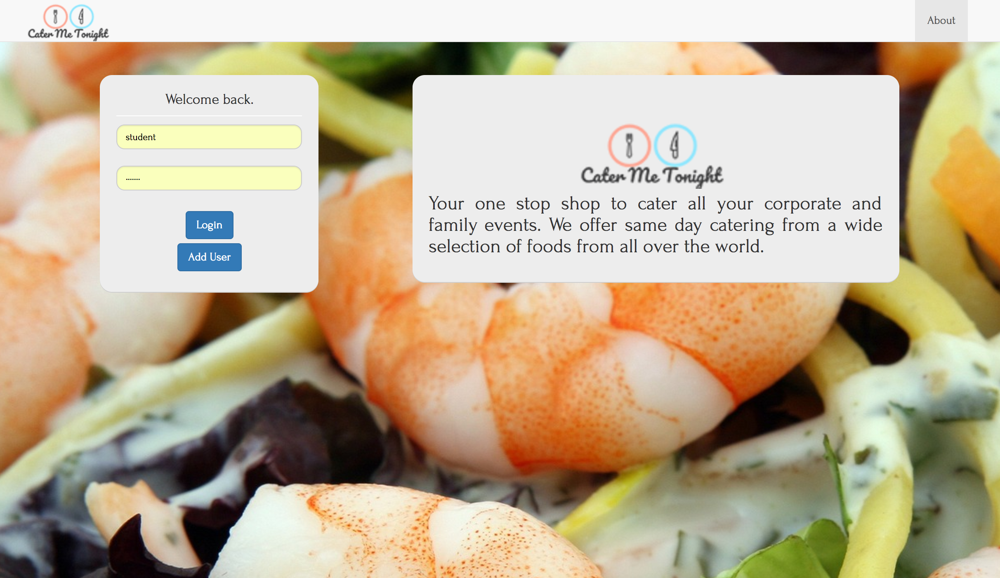
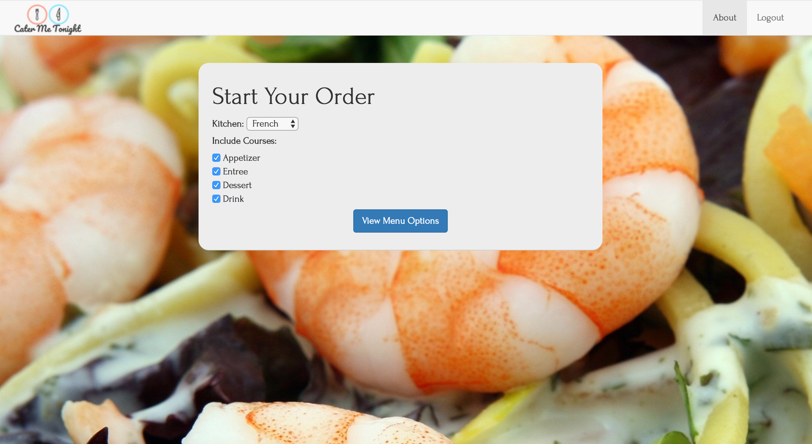
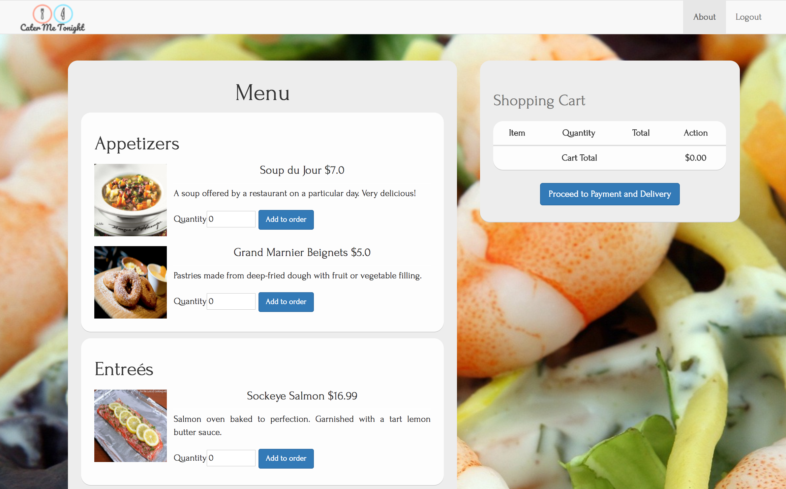
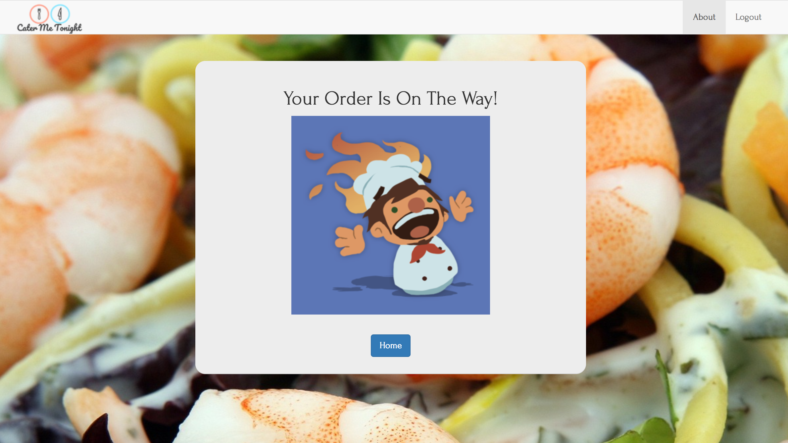
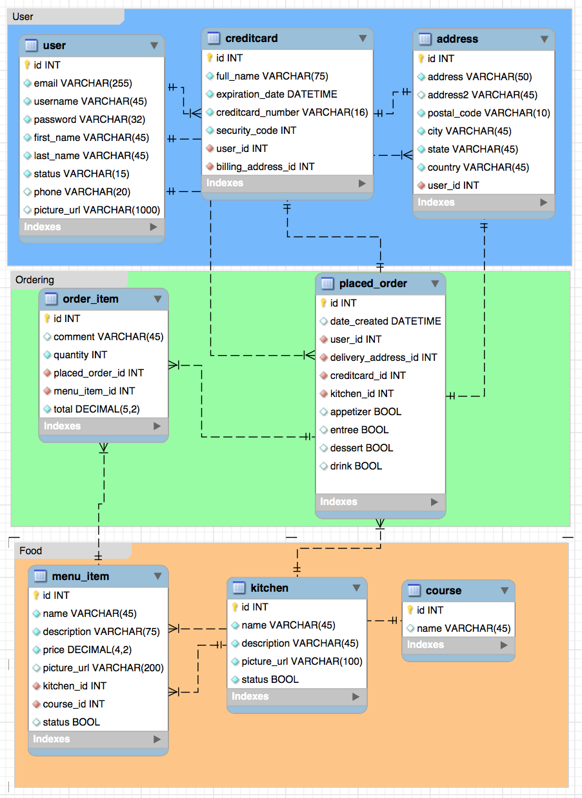

# Cater Me Tonight
A Spring MVC CRUD web application that is a one stop shop catering center for event planners to cater their events.

## In This Document:
1. [Application URL](#application-url)
2. [How to Use the Application](#how-to-use-the-application)
3. [Technologies Used](#technologies-used)
4. [Data Model](#data-model)
5. [Future Feature Sets](#future-feature-sets)
6. [Stumbling and Learning Points](#stumbling-and-learning-points)

## Application URL
http://shaundashjian.com:8080/CaterMeTonight/

## How to Use the Application
* As an Event Planner:
  * Event planner logs in with their username and password
  * They select their favorite cuisine to cater from and the courses to include
  * The next page lists all meu options to select from and add to their shopping cart 
  * When ready, they proceed to the next page where they select or enter their payment method and delivery address
  * Next they see the finalized order and when they sumbit order, they see a confirmation page
* As an Admin:
  * Admin logs in with their admin username and password
  * They view the admin page where they could view, edit, deactivate existing kitchens and their menu items
  * In addtion, admin could add new kitchens to the system or courses to exiting kitchens

## Technologies Used
  * [Spring Web MVC framework](https://docs.spring.io/spring/docs/current/spring-framework-reference/html/mvc.html)
  * JSP with Bootstrap
  * Gradle
  * MySQL
  * JPA 
  * Hibernate
  * Http sessions
  
  
## Data Model

## Future Feature Sets:
  * The applications sends a confirmation email to the event planner and caterer when submitting order
  * The caterer logs in to an order central where they view all pplaced orders
  * Event planner hass access to previous orders
  
## Stumbling and Learning Points:
  * Changing requirements and discovery
  * Paying attention to details when repurposing existing code
  * Following good engineering practices like code reviews and unit testing produce better software and is an investment in time and effort
  

[Up](README.md)
